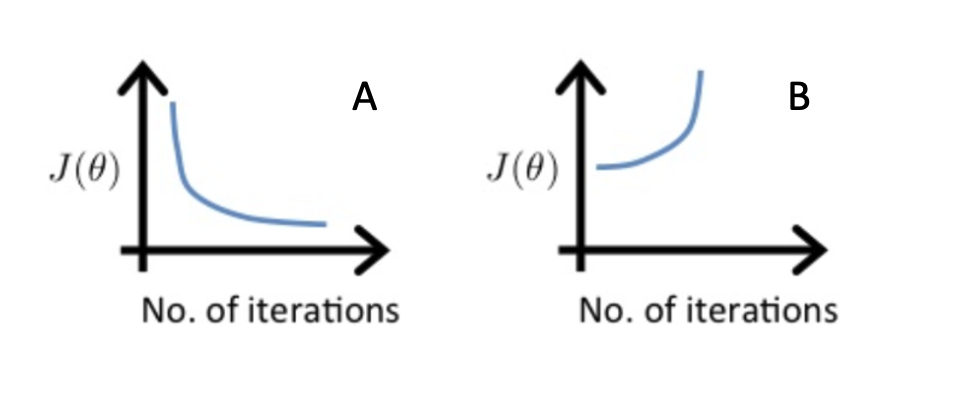

# Gradient Descent

## Graded Quiz

### Question 1

Which of the following is a valid step used during feature scaling?

- Subtract the mean (average) from each value and then divide by the (max - min).
- Add the mean (average) from each value and and then divide by the (max - min).

Answer: A

Explanation: This is called mean normalization.

### Question 2

Suppose a friend ran gradient descent two separate times with two choices of the learning rate $\alpha$ and plotted the learning curves for each (cost J for each iteration).

For which case, A or B, was the learning rate $\alpha$ likely too large?

- Neither Case A nor B
- Case A only
- Both Cases A and B
- Case B only

Answer: D

Explanation: The cost is increasing as training continues, which likely indicates that the learning rate alpha is too large.

### Question 3

Of the circumstances below, for which one is feature scaling particularly helpful?

- Feature scaling is helpful when one feature is much larger (or smaller) than another feature.
- Feature scaling is helpful when all the features in the original data (before scaling is applied) range from 0 to 1.

Answer: A

Explanation: For example, the "house size" in square feet may be as high as 2,000, which is much larger than the feature "number of bedrooms" having a value between 1 and 5 for most houses in the modern era.

### Question 4

You are helping a grocery store predict its revenue, and have data on its items sold per week, and price per item. What could be a useful engineered feature?

- For each product, calculate the number of items sold divided by the price per item.
- For each product, calculate the number of items sold times price per item.

Answer: B

Explanation: This feature can be interpreted as the revenue generated for each product.

### Question 5

True/False? With polynomial regression, the predicted values $f_{w,b}(x)$ does not necessarily have to be a straight line (or linear) function of the input feature x.

- True
- False

Answer: A

Explanation: A polynomial function can be non-linear. This can potentially help the model to fit the training data better.
