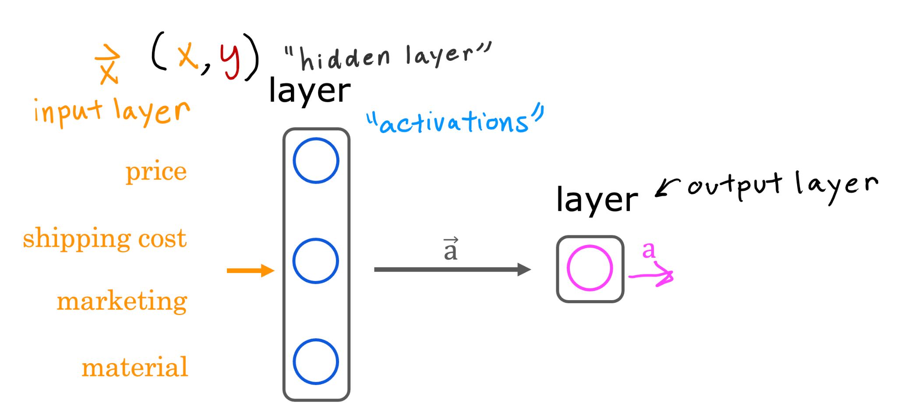

# Neural Networks Intuition

## Graded Quiz

### Question 1

Which of these are terms used to refer to components of an artificial neural network? (hint: three of these are correct)

- Neurons
- Activation function
- Layers
- Axon

Answer: ABC

Explanation:

- A neuron is a part of a neural network.
- An activation is the number calculated by a neuron (and "activations" in the figure above is a vector that is output by a layer that contains multiple neurons).
- A layer is a grouping of neurons in a neural network

### Question 2

True/False? Neural networks take inspiration from, but do not very accurately mimic, how neurons in a biological brain learn.

- False
- True

Answer: B

Explanation: Artificial neural networks use a very simplified mathematical model of what a biological neuron does.
