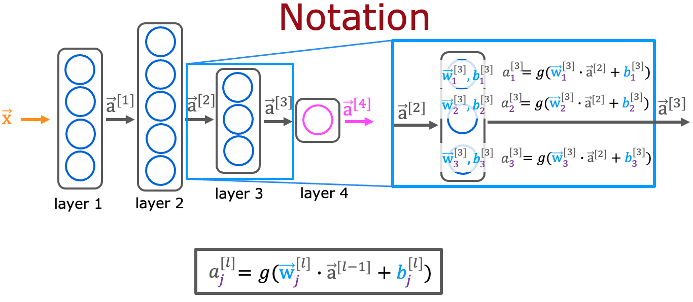
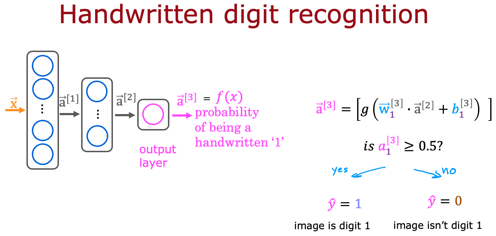

# Neural Networks Model

## Graded Quiz

### Question 1

For a neural network, what is the expression for calculating the activation of the third neuron in layer 2? Note, this is different from the question that you saw in the lecture video.

- $a_3^{[2]} = g(\vec{w}_3^{[2]} \cdot \vec{a}^{[2]} + b_3^{[2]})$
- $a_3^{[2]} = g(\vec{w}_2^{[3]} \cdot \vec{a}^{[2]} + b_2^{[3]})$
- $a_3^{[2]} = g(\vec{w}_3^{[2]} \cdot \vec{a}^{[1]} + b_3^{[2]})$
- $a_3^{[2]} = g(\vec{w}_2^{[3]} \cdot \vec{a}^{[1]} + b_2^{[3]})$

Answer: C

Explanation: The superscript $[2]$ refers to layer $2$. The subscript $3$ refers to the neuron in that layer. The input to layer $2$ is the activation vector from layer $1$.

### Question 2

For the handwriting recognition task discussed in lecture, what is the output $a_1^{[3]}$?

- A vector of several numbers, each of which is either exactly 0 or 1.
- A number that is either exactly 0 or 1, comprising the network’s prediction.
- The estimated probability that the input image is of a number 1, a number that ranges from 0 to 1.
- A vector of several numbers that take values between 0 and 1.

Answer: C

Explanation: The neural network outputs a single number between 0 and 1.
