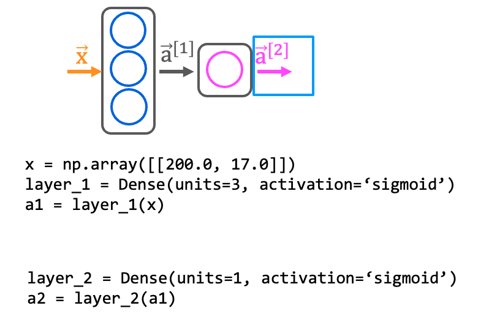
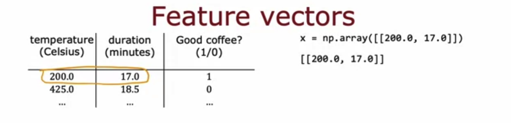

# TensorFlow Implementation

## Graded Quiz

### Question 1

For the the following code:

```python
model = Sequential([
    Dense(units=25, activation="sigmoid"),
    Dense(units=15, activation="sigmoid"),
    Dense(units=10, activation="sigmoid"),
    Dense(units=1, activation="sigmoid")
])
```

This code will define a neural network with how many layers?

- 4
- 5
- 3
- 25

Answer: A

Explanation: Each call to the "Dense" function defines a layer of the neural network.

### Question 2

How do you define the second layer of a neural network that has 4 neurons and a sigmoid activation?



- `Dense(units=[4], activation=['sigmoid'])`
- `Dense(units=4, activation='sigmoid')`
- `Dense(units=4)`
- `Dense(layer=2, units=4, activation='sigmoid')`

Answer: B

Explanation: This will have 4 neurons and a sigmoid activation.

### Question 3

If the input features are temperature (in Celsius) and duration (in minutes), how do you write the code for the first feature vector $x$ shown below?



- `x = np.array([[200.0], [17.0]])`
- `x = np.array([[200.0 + 17.0]])`
- `x = np.array([[200.0, 17.0]])`
- `x = np.array([['200.0', '17.0']])`

Answer: C

Explanation: A row contains all the features of a training example. Each column is a feature.
