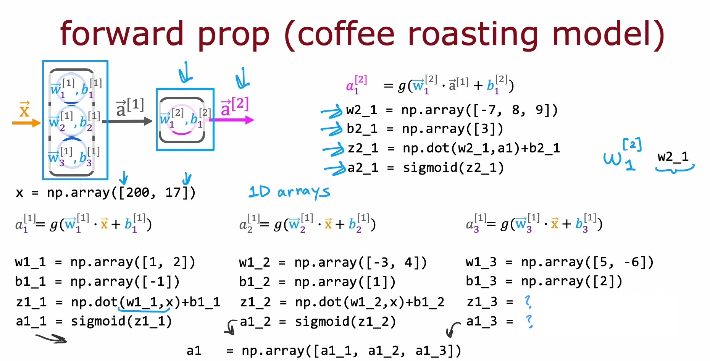
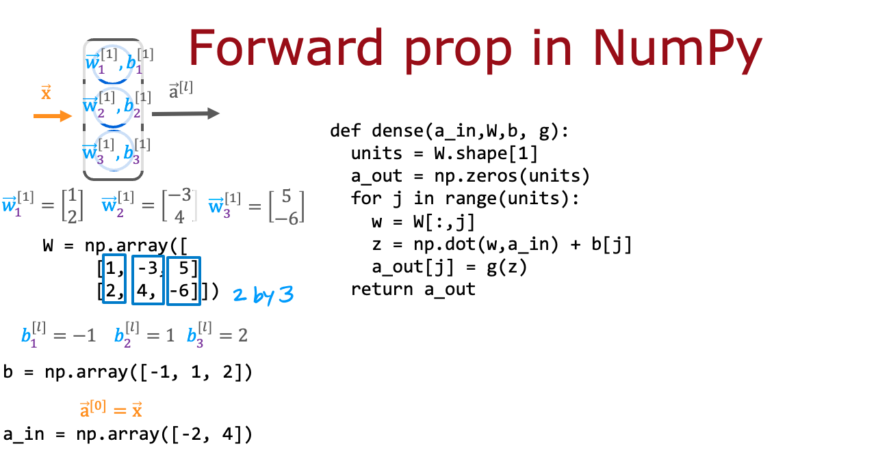

# Neural Networks Implementation in Python

## Graded Quiz

### Question 1

According to the lecture, how do you calculate the activation of the third neuron in the first layer using NumPy?

- `z1_3 = w1_3 * x + b;    a1_3 = sigmoid(z1_3)`
- `layer_1 = Dense(units=3, activation='sigmoid');    a_1 = layer_1(x)`
- `z1_3 = np.dot(w1_3, x) + b1_3;    a1_3 = sigmoid(z1_3)`

Answer: C

Explanation: Use the numpy.dot function to take the dot product. The sigmoid function shown in lecture can be a function that you write yourself (see course 1, week 3 of this specialization), and that will be provided to you in this course.

### Question 2

According to the lecture, when coding up the numpy array $W$, where would you place the $w$ parameters for each neuron?

- In the columns of W.
- In the rows of W.

Answer: A

Explanation: The $w$ parameters of neuron 1 are in column 1. The $w$ parameters of neuron 2 are in column 2, and so on.

### Question 3

For the code above in the "dense" function that defines a single layer of neurons, how many times does the code go through the "for loop"? Note that W has 2 rows and 3 columns.

- 5
- 3
- 6
- 2

Answer: B

Explanation: For each neuron in the layer, there is one column in the numpy array $W$. The for loop calculates the activation value for each neuron. So if there are 3 columns in $W$, there are 3 neurons in the dense layer, and therefore the for loop goes through 3 iterations (one for each neuron).
