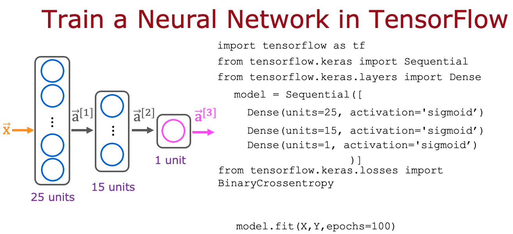

# Neural Networks Training

## Graded Quiz

### Question 1

Here is some code that you saw in the lecture:



```python
model.compile(loss=BinaryCrossentropy())
```

For which type of task would you use the binary cross entropy loss function?

- BinaryCrossentropy() should not be used for any task
- Regression tasks (tasks that predict a number)
- A classification task that has 3 or more classes (categories)
- Binary classification (classification with exactly 2 classes)

Answer: D

Explanation: Binary cross entropy, which we've also referred to as logistic loss, is used for classifying between two classes (two categories).

### Question 2

Here is code that you saw in the lecture:


```python
model = Sequential([
    Dense(units=25, activation='sigmoid'),
    Dense(units=15, activation='sigmoid'),
    Dense(units=1, activation='sigmoid')
])

model.compile(loss=BinaryCrossentropy())
model.fit(X, y, epochs=100)
```

Which line of code updates the network parameters in order to reduce the cost?

- `model = Sequential([...])`
- `model.fit(X, y, epochs=100)`
- `model.compile(loss=BinaryCrossentropy())`
- None of the above -- this code does not update the network parameters

Answer: B

Explanation: The third step of model training is to train the model on data in order to minimize the loss (and the cost)
