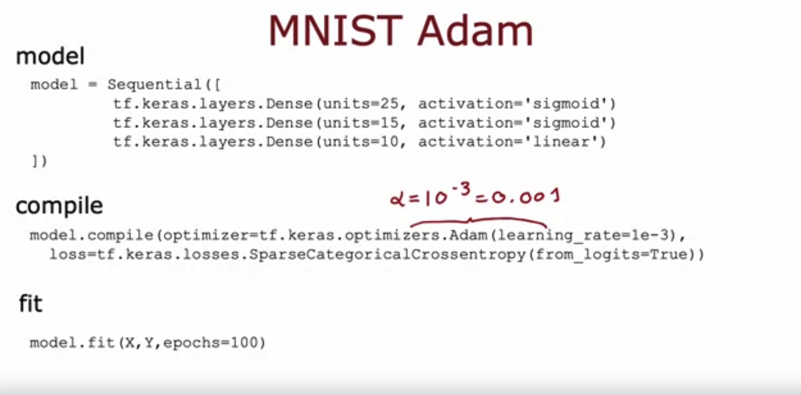

# Additional Neural Networks Concepts

## Graded Quiz

### Question 1

The Adam optimizer is the recommended optimizer for finding the optimal parameters of the model. How do you use the Adam optimizer in TensorFlow?

- The call to `model.compile()` uses the Adam optimizer by default.
- The Adam optimizer works only with Softmax outputs. So if a neural network has a Softmax output layer, TensorFlow will automatically pick the Adam optimizer.
- The call to `model.compile()` will automatically pick the best optimizer, whether it is gradient descent, Adam or something else. So there’s no need to pick an optimizer manually.
- When calling `model.compile()`, set `optimizer=tf.keras.optimizers.Adam(learning_rate=1e-3)`.

Answer: D

Explanation: Set the optimizer to Adam.

### Question 2

The lecture covered a different layer type where each single neuron of the layer does not look at all the values of the input vector that is fed into that layer. What is this name of the layer type discussed in lecture?

- Image layer
- 1D layer or 2D layer (depending on the input dimension)
- Convolutional layer
- A fully connected layer

Answer: C

Explanation: For a convolutional layer, each neuron takes as input a subset of the vector that is fed into that layer.
