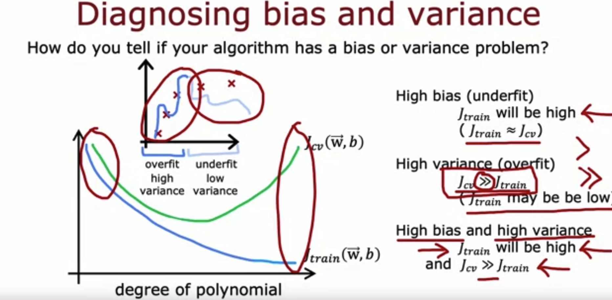

# Bias and Variance

## Graded Quiz

### Question 1

If the model's cross validation error $J_{cv}$ is much higher than the training error $J_{train}$, this is an indication that the model has ____.

- Low variance
- High bias
- Low bias
- High variance

Answer: D

Explanation: When $J_{cv} >> J_{train}$ (whether $J_{train}$ is also high or not), this is a sign that the model is overfitting to the training data and performing much worse on new examples.

### Question 2

Which of these is the best way to determine whether your model has high bias (has underfit the training data)?

- Compare the training error to the cross validation error.
- See if the cross validation error is high compared to the baseline level of performance
- See if the training error is high (above 15% or so)
- Compare the training error to the baseline level of performance

Answer: D

Explanation: If comparing your model's training error to a baseline level of performance (such as human level performance, or performance of other well-established models) is much higher, then this is a sign that the model has high bias (has underfit).

### Question 3

You find that your algorithm has high bias. Which of these seem like good options for improving the algorithm's performance? Hint: two of these are correct.

- Remove examples from the training set
- Decrease the regularization parameter $\lambda$
- Collect additional features or add polynomial features
- Collect more training examples

Answer: BC

Explanation: Decreasing regularization can help the model better fit the training data. More features could potentially help the model better fit the training examples.

### Question 4

You find that your algorithm has a training error of 2%, and a cross validation error of 20% (much higher than the training error). Based on the conclusion you would draw about whether the algorithm has a high bias or high variance problem, which of these seem like good options for improving the algorithm's performance? Hint: two of these are correct.

- Collect more training data
- Reduce the training set size
- Increase the regularization parameter $\lambda$
- Decrease the regularization parameter $\lambda$

Answer: AC

Explanation: The model appears to have high variance (overfit), and collecting more training examples would help reduce high variance. Increasing regularization would help reduce high variance.
