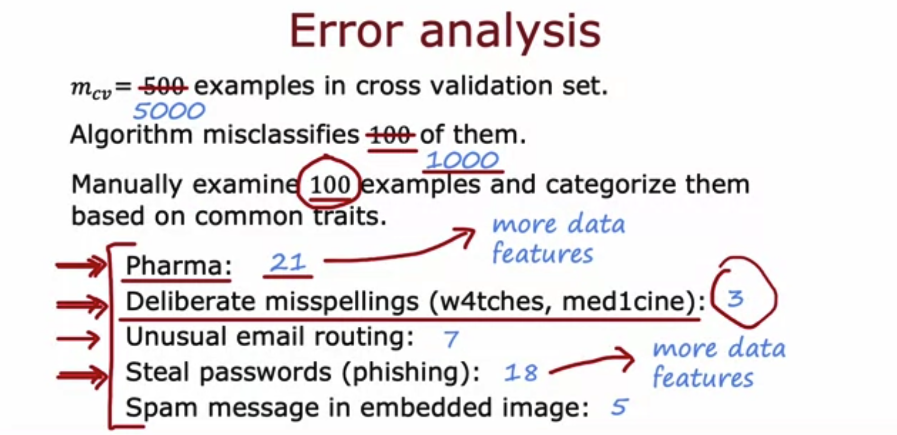

# Machine Learning Development Process

## Graded Quiz

### Question 1

Which of these is a way to do error analysis?

- Calculating the test error $J_{test}$​
- Calculating the training error $J_{train}$
- Collecting additional training data in order to help the algorithm do better.
- Manually examine a sample of the training examples that the model misclassified in order to identify common traits and trends.

Answer: D

Explanation: By identifying similar types of errors, you can collect more data that are similar to these misclassified examples in order to train the model to improve on these types of examples.

### Question 2

We sometimes take an existing training example and modify it (for example, by rotating an image slightly) to create a new example with the same label. What is this process called?

- Data augmentation
- Machine learning diagnostic
- Bias/variance analysis
- Error analysis

Answer: A

Explanation: Modifying existing data (such as images, or audio) is called data augmentation.

### Question 3

What are two possible ways to perform transfer learning? Hint: two of the four choices are correct.

- Given a dataset, pre-train and then further fine tune a neural network on the same dataset.
- You can choose to train all parameters of the model, including the output layers, as well as the earlier layers.
- Download a pre-trained model and use it for prediction without modifying or re-training it.
- You can choose to train just the output layers' parameters and leave the other parameters of the model fixed.

Answer: BD

Explanation: It may help to train all the layers of the model on your own training set. This may take more time compared to if you just trained the parameters of the output layers. The earlier layers of the model may be reusable as is, because they are identifying low level features that are relevant to your task.
