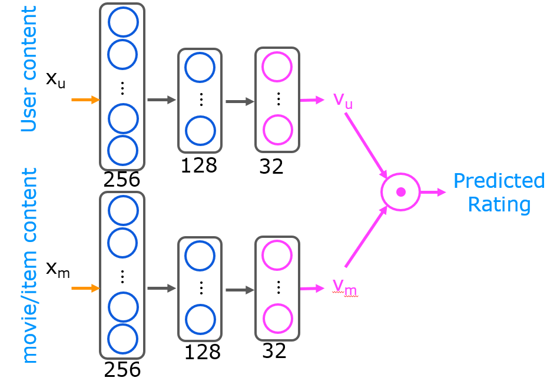

# Content Based Filtering

## Graded Quiz

### Question 1

Vector $x_u$ and vector $x_m$ must be of the same dimension, where $x_u$ is the input features vector for a user (age, gender, etc.) $x_m$ is the input features vector for a movie (year, genre, etc.) True or false?

- True
- False

Answer: B

Explanation: These vectors can be different dimensions.

### Question 2

If we find that two movies, $i$ and $k$, have vectors $v_m^{(i)}$ and $v_m^{(k)}$ that are similar to each other (i.e., $\Vert v_m^{(i)} - v_m^{(k)} \Vert$ is small), then which of the following is likely to be true? Pick the best answer.

- A user that has watched one of these two movies has probably watched the other as well.
- The two movies are similar to each other and will be liked by similar users.
- The two movies are very dissimilar.
- We should recommend to users one of these two movies, but not both.

Answer: B

Explanation: Similar movies generate similar $v_m$'s.

### Question 3

Which of the following neural network configurations are valid for a content based filtering application? Please note carefully the dimensions of the neural network indicated in the diagram. Check all the options that apply:

- The user and item networks have 64 dimensional $v_u$ and $v_m$ vector respectively.

- The user and the item networks have different architectures.

- Both the user and the item networks have the same architecture.

- The user vector $v_u$ is 32 dimensional, and the item vector $v_m$ is 64 dimensional.

Answer: ABC

Explanation: Feature vectors can be any size so long as $v_u$ and $v_m$ are the same size. User and item networks can be the same or different sizes.

### Question 4

You have built a recommendation system to retrieve musical pieces from a large database of music, and have an algorithm that uses separate retrieval and ranking steps. If you modify the algorithm to add more musical pieces to the retrieved list (i.e., the retrieval step returns more items), which of these are likely to happen? Check all that apply.

- The system's response time might increase (i.e., users have to wait longer to get recommendations)
- The quality of recommendations made to users should stay the same or worsen.
- The system's response time might decrease (i.e., users get recommendations more quickly)
- The quality of recommendations made to users should stay the same or improve.

Answer: AD

Explanation: A larger retrieval list may take longer to process which may increase response time. A larger retrieval list gives the ranking system more options to choose from which should maintain or improve recommendations.

### Question 5

To speed up the response time of your recommendation system, you can pre-compute the vectors $v_m$ for all the items you might recommend. This can be done even before a user logs in to your website and even before you know the $x_u$ or $v_u$ vector. True/False?

- True
- False

Answer: A

Explanation: The output of the item/movie neural network, $v_m$ is not dependent on the user network when making predictions. Precomputing the results speeds up the prediction process.
