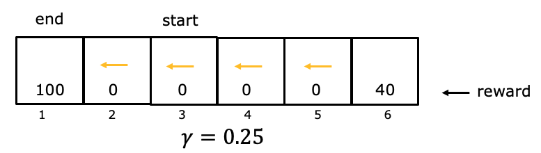

# Reinforcement Learning Introduction

## Graded Quiz

### Question 1

You are using reinforcement learning to control a four legged robot. The position of the robot would be its ____.

- return
- reward
- state
- action

Answer: C

### Question 2

You are controlling a Mars rover. You will be very very happy if it gets to state 1 (significant scientific discovery), slightly happy if it gets to state 2 (small scientific discovery), and unhappy if it gets to state 3 (rover is permanently damaged). To reflect this, choose a reward function so that:

- $R(1) < R(2) < R(3)$, where $R(1)$ and $R(2)$ are negative and $R(3)$ is positive.
- $R(1) > R(2) > R(3)$, where $R(1)$ and $R(2)$ are positive and $R(3)$ is negative.
- $R(1) > R(2) > R(3)$, where $R(1)$, $R(2)$ and $R(3)$ are positive.
- $R(1) > R(2) > R(3)$, where $R(1)$, $R(2)$ and $R(3)$ are negative.

Answer: B

### Question 3

You are using reinforcement learning to fly a helicopter. Using a discount factor of 0.75, your helicopter starts in some state and receives rewards -100 on the first step, -100 on the second step, and 1000 on the third and final step (where it has reached a terminal state). What is the return?

- $-0.75 \times 100 - 0.75^2 \times 100 + 0.75^3 \times 1000$
- $-100 - 0.75 \times 100 + 0.75^2 \times 1000$
- $-100 -0.25 \times 100 + 0.25^2 \times 1000$
- $-0.25 \times 100 - 0.25^2 \times 100 + 0.25^3 \times 1000$

Answer: B

### Question 4

Given the rewards and actions below, compute the return from state 3 with a discount factor of $\gamma=0.25$

- $0$
- $6.25$
- $25$
- $0.39$

Answer: B

Explanation: If starting from state 3, the rewards are in states 3, 2, and 1. The return is $0 + (0.25) \times 0 + (0.25)^2 \times 100 = 6.25$
