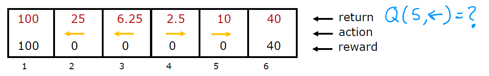

# State-Action Value Function

## Graded Quiz

### Question 1

Which of the following accurately describes the state-action value function $Q(s,a)$?

- It is the return if you start from state $s$, take action $a$ (once), then behave optimally after that.
- It is the return if you start from state $s$ and repeatedly take action $a$.
- It is the return if you start from state $s$ and behave optimally.
- It is the immediate reward if you start from state $s$ and take action $a$ (once).

Answer: A

### Question 2

You are controlling a robot that has 3 actions: $\leftarrow$ (left), $\rightarrow$ (right) and STOP. From a given state $s$, you have computed $Q(s,\leftarrow)=-10$, $Q(s,\rightarrow)=-20$, $Q(s, \text{STOP})=0$.

What is the optimal action to take in state $s$?

- STOP
- $\leftarrow$ (left)
- $\rightarrow$ (right)
- Impossible to tell

Answer: A

Explanation: This has the greatest value.

### Question 3

For this problem, $\gamma=0.25$. The diagram below shows the return and the optimal action from each state. Please compute $Q(5,\leftarrow)$.

- $0.625$
- $0.391$
- $1.25$
- $2.5$

Answer: A

Explanation: We get $0$ reward in state 5. Then $0 \times 0.25$ discounted reward in state 4, since we moved left for our action. Now we behave optimally starting from state 4 onwards. So, we move right to state 5 from state 4 and receive $0 \times 0.25^2$ discounted reward. Finally, we move right in state 5 to state 6 to receive a discounted reward of $40 \times 0.25^3$. Adding these together we get $0.625$.
