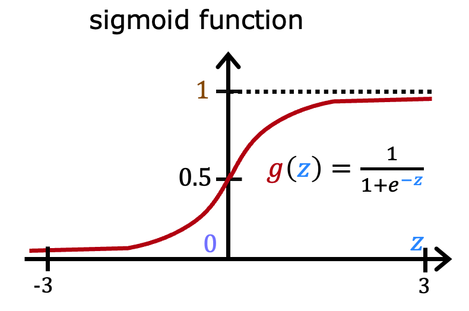
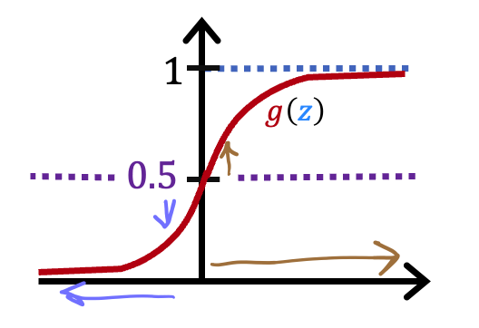

# Classification with Logistic Regression

## Graded Quiz

### Question 1

Which is an example of a classification task?

- Based on a patient's age and blood pressure, determine how much blood pressure medication (measured in milligrams) the patient should be prescribed.
- Based on the size of each tumor, determine if each tumor is malignant (cancerous) or not.
- Based on a patient's blood pressure, determine how much blood pressure medication (a dosage measured in milligrams) the patient should be prescribed.

Answer: B

Explanation: This task predicts one of two classes, malignant or not malignant.

### Question 2

Recall the sigmoid function is $g(z) = \frac{1}{1 + e^{-z}}$.

If $z$ is a large positive number, then:

- $g(z)$ is near $1$
- $g(z)$ is near $-1$
- $g(z)$ will be near $0$
- $g(z)$ will be near $0.5$

Answer: A

Explanation: Say $z = +100$. So $e^{-z}$ is then $e^{-100}$, a really small positive number. So, $g(z) = \frac{1}{1 + \text{a small positive number}}$ which is close to $1$.

### Question 3

A cat photo classification model predicts 1 if it's a cat, and 0 if it's not a cat. For a particular photograph, the logistic regression model outputs $g(z)$ (a number between 0 and 1). Which of these would be a reasonable criteria to decide whether to predict if it’s a cat?

- Predict it is a cat if $g(z) = 0.5$
- Predict it is a cat if $g(z) < 0.7$
- Predict it is a cat if $g(z) < 0.5$
- Predict it is a cat if $g(z) \ge 0.5$

Answer: D

Explanation: Think of $g(z)$ as the probability that the photo is of a cat. When this number is at or above the threshold of 0.5, predict that it is a cat.

### Question 4

True/False? No matter what features you use (including if you use polynomial features), the decision boundary learned by logistic regression will be a linear decision boundary.

- False
- True

Answer: A

Explanation: The decision boundary can also be non-linear, as described in the lectures.
