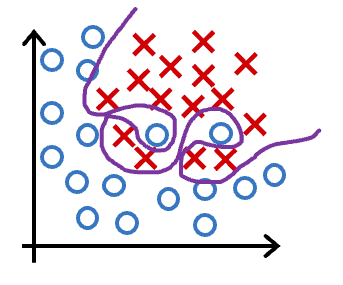

# The Problem of Overfitting

## Graded Quiz

### Question 1

Which of the following can address overfitting?

- Apply regularization
- Select a subset of the more relevant features
- Collect more training data
- Remove a random set of training examples

Answer: ABC

Explanation: Regularization is used to reduce overfitting. If the model trains on the more relevant features, and not on the less useful features, it may generalize better to new examples. If the model trains on more data, it may generalize better to new examples.

### Question 2

You fit logistic regression with polynomial features to a dataset, and your model looks like this.

What would you conclude? (Pick one)

- The model has high variance (overfit). Thus, adding data is likely to help.
- The model has high bias (underfit). Thus, adding data is, by itself, unlikely to help much.
- The model has high variance (overfit). Thus, adding data is, by itself, unlikely to help much.
- The model has high bias (underfit). Thus, adding data is likely to help.

Answer: A

Explanation: The model has high variance (it overfits the training data). Adding data (more training examples) can help.

### Question 3

Suppose you have a regularized linear regression model. If you increase the regularization parameter $\lambda$, what do you expect to happen to the parameters $w_1, w_2, ..., w_n$?

$$
\min_{\mathbf{w}, b} J\left(\mathbf{w}, b\right) =
\min_{\mathbf{w}, b} \left[
    \overbrace{\frac{1}{2m} \sum_{i=1}^{m}\left(f_{\mathbf{w}, b}\left(\mathbf{x}^{(i)}\right)-y^{(i)}\right)^2}^{\text{mean squared error}} +
    \overbrace{\frac{\lambda}{2m}\sum_{j=1}^{n}w_j^2}^{\text{regularization term}}
\right]
$$

- This will reduce the size of the parameters $w_1, w_2, ..., w_n$
- This will increase the size of the parameters $w_1, w_2, ..., w_n$

Answer: A

Explanation: Regularization reduces overfitting by reducing the size of the parameters $w_1, w_2, ..., w_n$
